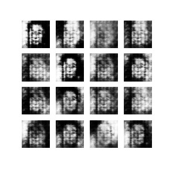

# Face DCGAN
  
My implementation of the GAN architecture from the DCGAN paper (see references) to generate human faces.

## How to Train
- Clone the Repository
- Install requirements from `requirements.txt`  
- Download the Flickr Faces dataset from [here](https://www.kaggle.com/xhlulu/flickrfaceshq-dataset-nvidia-resized-256px) (NOTE: The FFaces dataset has multiple resolution variants but in the end this doesn't matter since the data preparation scripts resize all images to 64x64)
- Place all the images in `{repo_folder}/faces/faces/{images}`
- Run either `prepare_color.py` or `prepare_grayscale.py` to resize and prepare the images.
- Modify the constants in `train.py` accordingly.
- Run `train.py`  

## Reference
'Unsupervised Representation Learning with Deep Convolutional Generative Adversarial Networks', A. Radford, L. Metz and S. Chintala (2016) ([arXiv](https://arxiv.org/abs/1511.06434))
